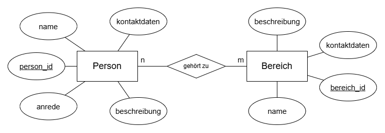

# SE3AA1
_Repository für das Assignment  zu ”Ausgewählte Aspekte des Software-Engineering I“_

Ziel des Projektes ist es, eine Webanwendung für das Verwalten von Kontakten zu entwickeln.

Personen haben jeweils einen Namen, Kontaktdaten, eine Anrede und eine Beschreibung.
Bereiche haben Ebenfalls Namen, Beschreibungen und Kontaktdaten.

So kann dokumentiert werden, wer in welcher Gruppe ist.
Es kann klar nach Bereichen wie Clubs, Arbeitsbereichen oder Freundeskreisen gefiltert werden, wobei auch Kontaktmöglichkeiten wie E-Mail Verteider für die eizelnen Bereiche erstellt werden können.

Aufgrund der N-M-Relation wird eine Join-Tabelle benötigt, welche von JPA automatisch generiert werden kann.